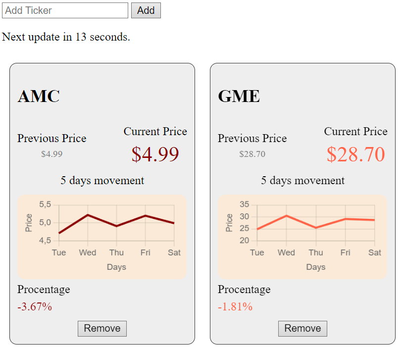

# Stock Price Tracker

## Framework
- Flask

## Functionality
- **Follow a Stock:** Users can track stocks using their ticker symbols.
- **Get a 5-Day Graph:** Visualizes historical data with a line chart.
- **Live Updates:** Prices update in real-time.

## Technologies Used
- **Frontend:** HTML, CSS, JavaScript (`jQuery`)
- **Charting Library:** `Chart.js`
- **Backend:** Flask for routing and data handling
- **Storage:** `localStorage` for persisting tracked stocks

## Implementation Details
- **Data Fetching:** AJAX requests to Flask server endpoint (`/get_stock_data`).
- **Charting:** `Chart.js` used to generate dynamic graphs.
- **Automatic Updates:** Prices refresh every 15 seconds.

## Deployment
- **Local Setup:** Clone the repository, install dependencies, run Flask app.
- **Production Deployment:** Host Flask app on a web server, ensure backend endpoints are reachable.

## Usage
1. **Add Stocks:** Enter ticker symbols and click "Add".
2. **Monitor Prices:** View live updates and historical trends.
3. **Remove Stocks:** Click "Remove" to stop tracking a stock.

## Example Image

## License
This project is licensed under the MIT License. See the [LICENSE](./LICENSE) file for details.
